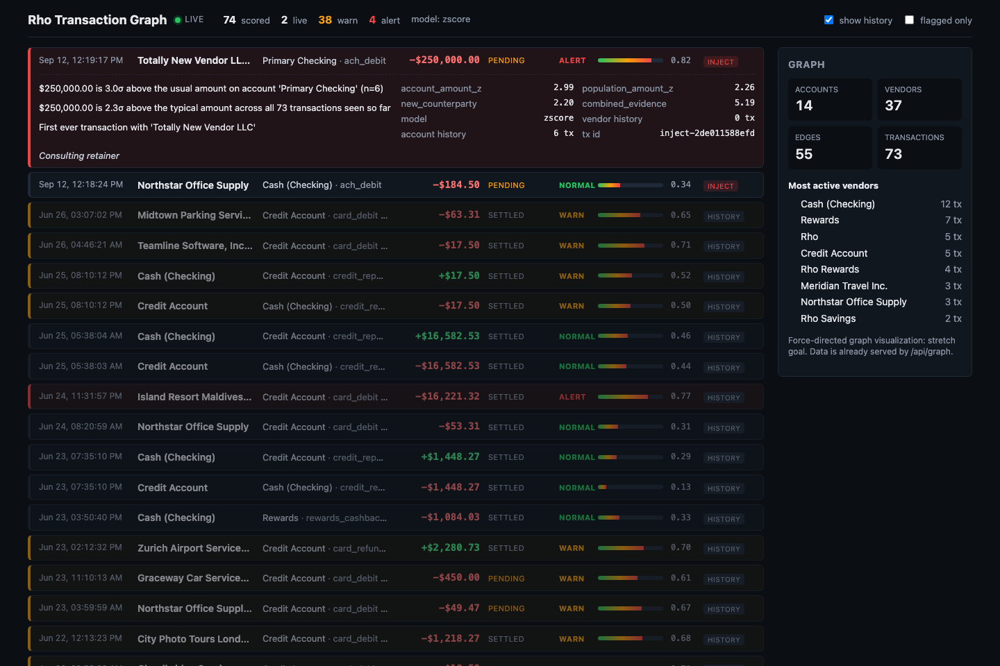

# Rho Transaction Graph

Real-time fraud / anomaly detection for business-banking transactions on [Rho](https://docs.rho.co).
Polls a company's Rho transaction feed, models it as a graph (accounts and vendors are nodes,
money movement is edges), scores every transaction for anomalies, and streams flagged
transactions to a live feed in the browser.

```
 Rho API ──poll──▶ Poller ──TransactionEvent──▶ EventBus ──▶ Pipeline ──ScoredTransaction──▶ SSE ──▶ React feed
 (sandbox)         cursor                      transactions.new   │ graph.apply(tx) → GraphFeatures
                                                                  │ scorer.score(tx, f) → AnomalyScore
 POST /api/demo/inject ──────────────────────▶ (same topic)       └─▶ transactions.scored
```



## Quickstart

Prereqs: [uv](https://docs.astral.sh/uv/) (Python 3.12+), Node 20+ with [pnpm](https://pnpm.io).

```bash
make install          # uv sync, copies backend/.env.example -> backend/.env, pnpm install
make backend          # API + poller + SSE on http://localhost:8000
make frontend         # Vite dev server on http://localhost:5173 (proxies /api to :8000)
make test             # backend unit tests
make graph-demo       # build the graph from the sandbox fixture, no server or key needed
make demo-inject      # push a suspicious $250,000 payment to a never-seen vendor through the live pipeline
```

Manual equivalents live in the `Makefile`. The backend must be started from `backend/` (it reads `backend/.env`).

### Configuration

Everything comes from `backend/.env` (gitignored). See `backend/.env.example` for every knob.
The important ones:

| Variable | Default | Meaning |
|---|---|---|
| `RHO_API_KEY` | `sandbox-any-token` | Bearer token. **The sandbox accepts any non-empty value.** Production tokens start with `rhobat_`. |
| `RHO_BASE_URL` | `https://rhoapi-sandbox.rho.co/api/v1` | Swap for `https://rhoapi.rho.co/api/v1` in production. |
| `POLL_INTERVAL_SECONDS` | `5` | Rho allows ~60 req/min per token. |
| `BACKFILL_ON_START` | `true` | Walk the whole feed oldest → newest on every start so the in-memory graph and scorer have a baseline (emitted as history). The cursor keeps steady-state polls from re-emitting known rows as live events. |
| `SCORER` | `zscore` | `zscore` or `autoencoder` (stub, falls back to zscore until implemented). |
| `DEMO_REPLAY` | `false` | Replay the fixture as if live, one row every `DEMO_REPLAY_INTERVAL_SECONDS`. |

## What we learned about the Rho sandbox (read this before building on it)

| Fact | Why it matters |
|---|---|
| The sandbox feed is **static**: exactly 72 transactions dated 2023-05-31 → 2026-06-26, identical on every call, and every endpoint is GET-only. | Nothing new will ever arrive by polling. The pitch demo ("trigger a transaction, watch it get flagged") runs through `POST /api/demo/inject`, which feeds the exact same pipeline. |
| `GET /transactions` is newest-first and paginates with `page_size` (1–100) + opaque `page_token`; the next cursor is `page.next_page_token`. | Cursor tracking is a client-side watermark (`backend/.state/cursor.json`: seen ids + last status), not the page token. |
| Filters that work: `status`, `transaction_type`, `posted_after`, `initiated_after` (undocumented), `sort_by=initiated_at&order=asc`. Unknown params are silently ignored. | Backfill walks oldest → newest with `order=asc`. `initiated_after=<high water>` is the obvious hardening step to shrink each poll. |
| `posted_at` is null while `pending` / `awaiting_approval`; status later moves to `settled` or `failed`. | The cursor keys on `(id, status)`, so a status change surfaces as an `updated` event and is re-scored without re-inserting into the graph. |
| There is **no counterparty id**, only `counterparty_name`. Internal transfers name the other account ("Cash (Checking)"). | Vendor nodes key on a normalized name. |
| Amounts are signed minor units, heavy-tailed ($7 → $1.3M). | Z-scores run on `log1p(|amount|)`. |
| Rate limit ≈ 60 req/min per token, 429 carries `Retry-After`. | The client honors it and backs off with jitter. |

Sandbox payloads are checked in under `backend/fixtures/` so the graph and scorer can be developed offline.

## The interface contract (what the split builds against)

Everything is in [`backend/app/models.py`](backend/app/models.py). Stages only ever exchange these:

| Model | Produced by | Consumed by |
|---|---|---|
| `TransactionEvent` (`kind: new\|updated`, `transaction`, `backfill`, `source: rho\|replay\|inject`) | `poller/poller.py`, `poller/simulator.py`, `/api/demo/inject` | `pipeline.py` via bus topic `transactions.new` |
| `GraphFeatures` | `graph/graph.py` → `TransactionGraph.apply(tx)` (computed **before** the tx is inserted) | any `Scorer` |
| `AnomalyScore` (`score 0..1`, `level: normal\|warn\|alert`, `reasons[]`, `components{}`) | `scoring/zscore.py` (or the autoencoder once it exists) | `pipeline.py` |
| `ScoredTransaction` | `pipeline.py` on bus topic `transactions.scored` | `realtime/broadcaster.py` (SSE), `/api/transactions` |

Adding a new source = publish `TransactionEvent` on `transactions.new`. Adding a new model = implement `Scorer.score(tx, features)` and register it in `scoring/__init__.py`. Nothing else changes.

## HTTP surface

| Route | Purpose |
|---|---|
| `GET /api/health` | liveness, poller + cursor status, background task state |
| `GET /api/stream` | SSE. `event: transaction` carries a `ScoredTransaction`; `event: heartbeat` every 15 s |
| `GET /api/transactions?limit=100&flagged=false` | recent scored transactions, newest first |
| `GET /api/graph` | `{nodes, edges, stats}` for the graph view |
| `GET /api/stats` | pipeline counters, graph stats, SSE stats |
| `POST /api/poll-now` | self-trigger hook: poll Rho now instead of waiting for the next interval tick |
| `POST /api/demo/inject?dry_run=false` | body: `{"counterparty_name", "amount" (signed cents), "account_id"?, "memo"?, ...}` → returns the `ScoredTransaction`. `dry_run=true` scores without publishing or touching the graph (handy for tuning). |

## Scoring (z-score baseline)

Each signal is a z-like magnitude. The three amount signals measure the same thing at different
granularity, so only the largest counts; amount, new-vendor and velocity are independent evidence and
add up (noisy-OR): `score = 1 - exp(-(amount_z + new_counterparty + velocity) / 3)`
(evidence ≈ 2.1 → 0.5 warn, ≈ 4.2 → 0.75 alert). So a new vendor alone is a warn, and a new vendor
receiving an unusually large amount is an alert. The std used in any z-score is floored at
`max(0.25, 1/sqrt(n-1))` in log space so two data points cannot make a 3x change look like 5σ.

- `counterparty_amount_z`: amount vs this vendor's history (needs `MIN_HISTORY=2` points)
- `account_amount_z`: amount vs this account's history
- `population_amount_z`: amount vs **all** transactions seen so far. Keeps a statistical signal alive when the vendor/account have little history (the sandbox has 37 vendors across 72 rows).
- `new_counterparty`: fixed pseudo-z (2.2 → warn on its own)
- `velocity`: ≥ 5 transactions on the account within an hour

`scoring/autoencoder.py` is a stub with the same interface, a `featurize()` vector, and TODOs describing the training plan.

## Repo layout

```
backend/
  app/models.py          the contract
  app/bus.py             in-process pub/sub (transactions.new, transactions.scored)
  app/rho_client.py      httpx client: pagination, 429/Retry-After, backoff
  app/poller/            cursor.py (watermark), poller.py (loop), simulator.py (replay + inject)
  app/graph/             schema.py (node/edge shapes), graph.py (networkx + running stats), demo.py
  app/scoring/           base.py (protocol), zscore.py, autoencoder.py (stub)
  app/realtime/          broadcaster.py (SSE fan-out)
  app/pipeline.py        graph -> scorer -> scored topic
  app/main.py            FastAPI app, lifespan, routes
  fixtures/              real sandbox payloads
  tests/                 cursor, graph, zscore
frontend/src/
  api.ts                 fetch helpers + useTransactionStream (EventSource)
  App.tsx                header, counters, filters, feed
  components/            TransactionRow.tsx (anomaly highlighting), GraphView.tsx (stretch-goal placeholder)
  types.ts               TS mirror of models.py
```

## Ownership (fill in before hour 1)

| Area | Owner |
|---|---|
| Plumbing: poller reliability, cursor, rate limits, backend infra | Max (per the first commit) |
| Graph: node/edge features, wiring real transactions in | Eva (per the first commit) |
| ML: scoring, autoencoder | Max (per the first commit) |
| Frontend: feed, highlights, graph viz | confirm before hour 9 |

Merge point (hours 7–9): scoring output into the SSE feed. Already wired end to end here; that session is for hardening with real scores, not first integration.

## Next steps / out of scope for hour 0–1

- Autoencoder: implement `fit()` / `score()` in `scoring/autoencoder.py`, train on the backfill rows.
- Force-directed graph visualization in `GraphView.tsx` (data is already served by `/api/graph`).
- Poller hardening: `initiated_after=<high water>` per tick, a periodic `status=pending` sweep to catch settlements, metrics.
- Optional LLM-generated one-line explanation per alert (narrates `AnomalyScore.reasons` into plain English for the demo UI — needs an LLM API key, only worth doing if hours 9–13 have slack).
- WebSocket variant of the broadcaster if bidirectional needs appear.
- Scale story for the pitch: one polling worker per company, Kafka-style stream ingestion beyond polling, graph sharded per company and pruned of aged-out low-risk nodes.
