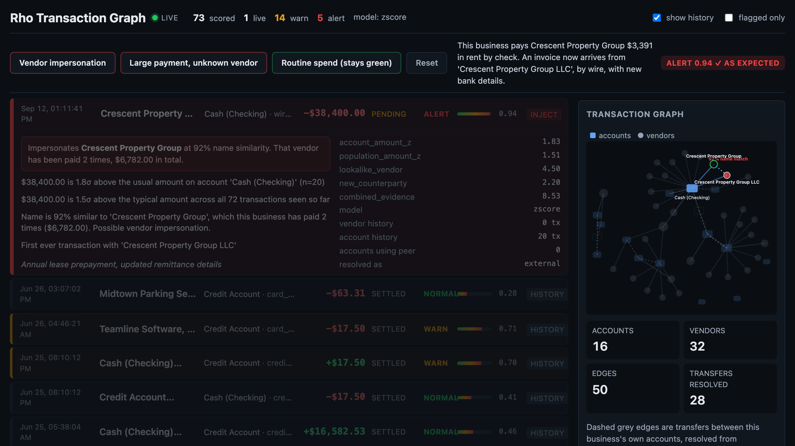
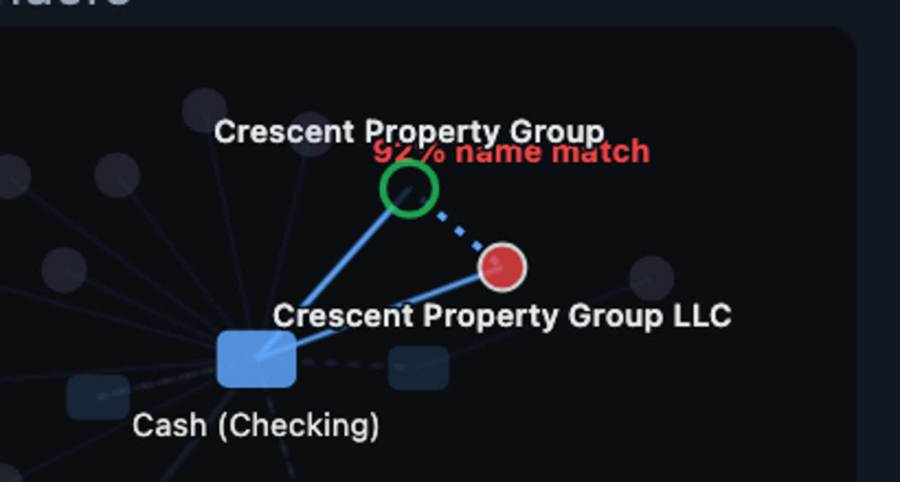
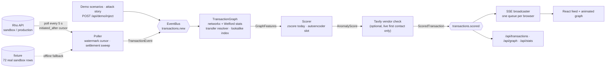

<div align="center">

# Rho Transaction Graph

### It remembers every vendor you have ever paid. So it notices when someone is only *pretending* to be one.

Real-time vendor-fraud detection for [Rho](https://rho.co) business banking, built in one day at RhoHack.<br/>
Rho transaction feed → live graph of accounts and vendors → every payment scored, explained, and on screen in milliseconds, while it is still `pending`.




**Judges, start here:** [the attack, in 23 seconds](#-watch-it-catch-an-attack) · [why a graph](#-why-a-graph-and-not-a-rules-engine) · [what the score is made of](#-what-the-score-is-made-of) · [what we learned about the Rho API](#-built-on-the-real-rho-api-and-what-we-learned-about-it) · [run it](#-run-it)

</div>

---

## 💸 The problem, in one invoice

A company pays **Crescent Property Group** $3,391 in rent, by check, every month. One day an invoice arrives from **Crescent Property Group LLC**: new bank details, an urgent wire for $38,400. A person approves it, because they recognise the name.

That is business email compromise, the most expensive fraud in business banking. The FBI's Internet Crime Complaint Center logged **$2.9 billion** in reported losses from it in 2023. No amount threshold catches it, because the attacker's whole job is to make the number look ordinary. No blocklist catches it, because the name has never been seen before.

Rho Transaction Graph catches it because it knows who this business pays:

> **ALERT 0.94** — Name is 92% similar to 'Crescent Property Group', which this business has paid 2 times ($6,782.00). Possible vendor impersonation.

That sentence is not a template. The 92%, the 2 payments and the $6,782 are read off the real vendor's node in the graph at the moment the impostor's payment arrives.

## 🎬 Watch it catch an attack

One button. Twenty-three seconds. Every stage is a real transaction pushed through the same pipeline that scores the live Rho feed, narrated on screen as it plays.

**▶ Anatomy of a vendor-fraud attack**

| | Stage | What arrives | Verdict |
|---|---|---|---|
| 1 | Business as usual | $51 card charge at Northstar Office Supply, a vendor already in the graph | 🟢 normal 0.30 |
| 2 | Rent goes out | $3,391 check to Crescent Property Group, exactly like the last two months | 🟢 normal 0.23 |
| 3 | The impostor invoices | $38,400 wire to "Crescent Property Group **LLC**", new remittance details | 🔴 **alert 0.94** · impersonates Crescent Property Group, 92% |
| 4 | The attacker pivots | $12,750 ACH to "N**0**rthstar Office Supply", a zero where the O should be | 🔴 **alert 0.93** · impersonates Northstar Office Supply, 96% |

Finale card: **$51,150 intercepted · 2 alerts · 2 cleared.** The two real payments stay green. The two fakes light up. Nobody wrote a rule for either of them.

Three single-shot buttons answer the questions judges actually ask:

| Button | The question it answers | Score |
|---|---|---|
| **Vendor impersonation** | "Can it catch the one that looks normal?" | 🔴 **alert 0.94** |
| **Large payment, unknown vendor** | "Can it catch the obvious one?" ($250,000 to a never-seen vendor) | 🔴 **alert 0.82** |
| **Routine spend (stays green)** | "Does it just flag everything?" ($51 at a known vendor) | 🟢 **normal 0.30** |

Those numbers are pinned. [`test_baseline.py`](backend/tests/test_baseline.py) asserts `0.9417`, `0.8226` and `0.2969` exactly, so a change that moves the pitch fails the suite on purpose.

**Press it ten times, get the same answer ten times.** Every scenario reseeds the graph from the fixture before injecting, because an online model has no undo: Welford's accumulator cannot forget a sample, and an injected amount moves the account and population baselines too. Reseeding 72 transactions, rebuilding the graph and scoring the injected payment takes **5 ms** end to end (`"elapsed_ms": 5.0` straight from the API).

**No wifi? No problem.** If Rho is unreachable, or there is no API key at all, the same 72 sandbox transactions replay from [`backend/fixtures/`](backend/fixtures/) and every scenario scores identically. The header shows an `offline · fixture data` pill so nobody is misled. Press **P** for projector-sized text.

<div align="center">

<br/><sub>The graph view during the impersonation scenario. New vendors grow in, live alerts pulse, and the impostor is drawn beside the vendor it imitates.</sub>
</div>

## 🕸 Why a graph, and not a rules engine

A threshold on amount cannot see the impostor: $38,400 is an ordinary wire. A blocklist cannot see it: the name is brand new. What can see it is a memory of who this business pays, and that is exactly what a graph of accounts and vendors accumulates for free.

- **Vendors are nodes, so a new name can be compared to every name already paid.** A `LookalikeIndex` (standard-library `difflib` behind an inverted token index plus a prefix bucket, so the O(n·m) comparison runs rarely) checks each brand-new counterparty against every existing vendor. Corporate filler such as LLC, Inc, Services and Group carries no weight, so "Acme Services LLC" never matches "Zenith Services LLC".
- **The margin is wide, and we measured it.** Across all 465 pairs of genuine sandbox vendors, the two most similar names are "Canal House Bistro Amsterdam" and "Bowline Journeys Amsterdam" at **0.556**. Planted impostors land between **0.81 and 0.98**. The 0.80 threshold sits in the empty band between them: 0 false positives across the 465 pairs, 5 of 5 impostor variants caught (extra suffix, dropped letter, digit for a letter, pluralised word, singularised word). Both facts are tests, not claims.
- **Internal transfers become real edges, not phantom vendors.** Rho exposes no counterparty id, only a name, and for a transfer between your own accounts that name is literally "Cash (Checking)". The naive graph draws a fake vendor and every account-to-account path dies in the middle. A four-tier resolver (sibling leg of the same `money_movement_id` → unique account name → merged node for ambiguous names like "Credit Account" → real vendor) fixes **28 of the 72** sandbox transactions and removes **6 phantom vendors**. Only real vendors enter the impersonation index, so paying yourself can never trigger a new-vendor alert.
- **Every node carries running statistics.** Welford mean and standard deviation of log-amounts per vendor, per account and across the whole population, so a payment is judged against *this vendor's* history and *this account's* history rather than a global rule. Features are computed before a transaction is inserted, so a payment never contaminates the baseline it is judged against.

## 🧮 What the score is made of

Each signal is a z-like magnitude. The three amount signals measure the same thing at different granularity, so only the largest counts. Amount, impersonation, first contact and velocity are independent evidence and add up:

```
score = 1 − exp(−(amount_z + lookalike + new_counterparty + velocity) / 3)

evidence 2.1 → 0.50 warn        evidence 4.2 → 0.75 alert
```

| Signal | What it measures | Weight and rule |
|---|---|---|
| `lookalike_vendor` | brand-new vendor whose name impersonates one already paid | **4.5**, clears alert on its own |
| `counterparty_amount_z` | amount vs this vendor's own history | needs ≥ 2 prior payments |
| `account_amount_z` | amount vs this account's history | |
| `population_amount_z` | amount vs everything seen so far | keeps a signal alive when history is thin |
| `new_counterparty` | first contact with a vendor | **2.2**, counted only when corroborated |
| `velocity` | ≥ 5 transactions on one account within an hour | |

Three decisions that make the feed worth reading:

- **Alert fatigue is a bug.** Counting "first ever transaction with X" unconditionally made 38 of 72 sandbox rows yellow, a feed nobody would look at. First contact now counts only alongside an unusual amount, a lookalike match or a velocity burst: 15 yellow rows, every alert preserved.
- **Impersonation is deliberately not gated.** It clears alert alone because the amount on a real BEC invoice is designed to look ordinary. Requiring a second signal would miss the actual attack.
- **Two data points are not a baseline.** The standard deviation used in any z-score is floored at `max(0.25, 1/√(n−1))` in log space, so two observations cannot make a 3× change look like 5σ.

Every score ships with its evidence. This is the real API response for the impersonation scenario:

```
score: 0.9417   level: alert
components: {"account_amount_z": 1.827, "population_amount_z": 1.511,
             "lookalike_vendor": 4.5, "new_counterparty": 2.2, "combined_evidence": 8.527}
reasons:
  - $38,400.00 is 1.8σ above the usual amount on account 'Cash (Checking)' (n=20)
  - $38,400.00 is 1.5σ above the typical amount across all 72 transactions seen so far
  - Name is 92% similar to 'Crescent Property Group', which this business has paid 2 times ($6,782.00). Possible vendor impersonation.
  - First ever transaction with 'Crescent Property Group LLC'
```

And for the $51 that stays green:

```
score: 0.2969   level: normal
components: {"counterparty_amount_z": 0.007, "account_amount_z": 0.794, "population_amount_z": 1.057, "combined_evidence": 1.057}
reasons:
  - $51.00 is 1.1σ below the typical amount across all 72 transactions seen so far
```

**Optional web check.** With a Tavily key, a brand-new vendor on a *live* transaction is searched on the open web. An impostor usually has no website; that absence sharpens an alert the graph already raised, but it can never change a level (normal stays normal, warn stays warn), it never runs on backfill or replay, and an outage scores exactly like no verifier at all. Twenty tests pin that behaviour, outage paths included. It is off in the demo.

## 🔌 Built on the real Rho API, and what we learned about it

Everything here was verified against the live sandbox, not the docs. If you build on the Rho sandbox after us, this table will save you an hour.

| Fact | Why it matters |
|---|---|
| The sandbox feed is **static**: exactly 72 transactions dated 2023-05-31 → 2026-06-26, identical on every call, and every endpoint is GET-only. | Nothing new ever arrives by polling. The demo injects through `POST /api/demo/inject`, which feeds the exact same pipeline as the poller. |
| `GET /transactions` is newest-first and paginates with `page_size` (1–100) plus an opaque `page_token`. | Cursor tracking is a client-side watermark (seen ids + last status + high-water `initiated_at`), not the page token. |
| Filters that work: `status`, `transaction_type`, `posted_after`, `initiated_after` (undocumented), `sort_by=initiated_at&order=asc`. Unknown params are silently ignored. | Backfill walks oldest → newest. Steady-state ticks ask only for rows after the high-water mark. |
| `posted_at` is null while `pending` / `awaiting_approval`; status later moves to `settled` or `failed`. | The cursor keys on `(id, status)`, so a settlement surfaces as an `updated` event and is re-scored without re-inserting into the graph. |
| There is **no counterparty id**, only `counterparty_name`. Internal transfers name the other account. | Hence the resolver above. Vendor nodes key on a normalised name. |
| Amounts are signed minor units and heavy-tailed ($7 → $1.3M). | Z-scores run on `log1p(\|amount\|)`. |
| Rate limit ≈ 60 req/min per token; 429 carries `Retry-After`. | The client honours it and backs off with jitter. |

**The poller is built to run for weeks, not for a demo.** After backfill, each 5-second tick sends exactly one request with `initiated_after=<high water>`, which comes back empty when nothing changed. Because that filter is a strict `>`, a settlement on an older row would be invisible, so every sixth tick separately re-checks everything still `pending` by id. The cursor is persisted to disk, so a restart does not replay history as live events. Live health from the running instance while this README was written: `"ticks": 969, "consecutive_failures": 0, "data_source": "rho"`.

## 🛡 Engineering that survives a stage

- **89 tests in 0.48 seconds.** Cursor semantics, the poller against a fake Rho (incremental ticks, the settlement sweep, backfill-as-history, the poll-now hook), graph construction and transfer resolution, the 465-pair impostor sweep, every scoring rule, scenario repeatability, the story timeline frame by frame, and Tavily timeouts, 5xx, missing key and network failure.
- **The pitch numbers are a test.** If a teammate's feature nudges an alert from 0.94 to 0.91, CI says so before the rehearsal does.
- **One contract, two people.** Every stage exchanges only the models in [`backend/app/models.py`](backend/app/models.py): `TransactionEvent` → `GraphFeatures` → `AnomalyScore` → `ScoredTransaction`. Adding a source is publishing a `TransactionEvent`. Adding a model is implementing `Scorer.score(tx, features)`. Nothing else changes.
- **Degrade, never abort.** Missing key, dead network, Tavily outage, a 429: each one narrows what the app does and says so in the header. None of them stops the demo.

```
$ cd backend && uv run pytest -q
........................................................................ [ 80%]
.................                                                        [100%]
89 passed in 0.48s
```

## 🏗 Architecture



```
backend/app/
  models.py              the contract every stage builds against
  bus.py                 in-process pub/sub (transactions.new, transactions.scored)
  rho_client.py          httpx client: pagination, 429 / Retry-After, jittered backoff
  poller/                cursor.py (watermark), poller.py (ticks + sweep), simulator.py (replay + inject)
  graph/                 graph.py (networkx + running stats), resolver.py (transfers), lookalike.py (impostors)
  scoring/               base.py (protocol), zscore.py, vendor_lookup.py (Tavily), autoencoder.py (stub)
  demo/                  seed.py (reseed + offline bootstrap), scenarios.py (buttons + the story)
  realtime/              broadcaster.py (SSE fan-out)
  pipeline.py            graph → scorer → verifier → scored topic
  main.py                FastAPI app, lifespan, routes
backend/fixtures/        real sandbox payloads, checked in
backend/tests/           89 tests
frontend/src/
  App.tsx                header, counters, filters, projector mode, feed
  components/            DemoPanel, TransactionRow (evidence drawer), GraphView, GraphCanvas
  graph/                 layout.ts (d3-force, deterministic), useTweenedLayout.ts (animation)
  api.ts                 fetch helpers + useTransactionStream (EventSource)
```

## 🚀 Run it

Prereqs: [uv](https://docs.astral.sh/uv/) (Python 3.12+), Node 20+ with [pnpm](https://pnpm.io).

```bash
make install     # uv sync, copies backend/.env.example -> backend/.env, pnpm install
make backend     # API + poller + SSE on http://localhost:8000
make frontend    # Vite dev server on http://localhost:5173 (proxies /api to :8000)
make test        # 89 backend tests
make graph-demo  # build the graph from the fixture and print the stats; no server, no key
```

The sandbox accepts any non-empty token, so the copied `.env` works as is. Open the frontend and press a button.

<details>
<summary><b>Configuration</b> (all in <code>backend/.env</code>, see <code>.env.example</code> for every knob)</summary>

| Variable | Default | Meaning |
|---|---|---|
| `RHO_API_KEY` | `sandbox-any-token` | Bearer token. The sandbox accepts any non-empty value; production tokens start with `rhobat_`. |
| `RHO_BASE_URL` | `https://rhoapi-sandbox.rho.co/api/v1` | Swap for `https://rhoapi.rho.co/api/v1` in production. |
| `POLL_INTERVAL_SECONDS` | `5` | Rho allows ~60 req/min per token. |
| `BACKFILL_ON_START` | `true` | Walk the whole feed oldest → newest on start so the graph has a baseline (emitted as history). |
| `PENDING_SWEEP_EVERY_N_TICKS` | `6` | How often to re-check in-flight transactions by id for settlement. |
| `SCORER` | `zscore` | `zscore` or `autoencoder` (stub, falls back to zscore). |
| `WARN_THRESHOLD` / `ALERT_THRESHOLD` | `0.5` / `0.75` | Level cut-offs on the 0–1 score. |
| `TAVILY_API_KEY` | empty | Empty = no web lookups; scoring is unchanged. |
| `DEMO_OFFLINE` | `false` | Force fixture mode to rehearse the no-wifi path. |
| `DEMO_REPLAY` | `false` | Replay the fixture as if live, one row every `DEMO_REPLAY_INTERVAL_SECONDS`. |

</details>

<details>
<summary><b>HTTP surface</b></summary>

| Route | Purpose |
|---|---|
| `GET /api/demo/scenarios` | the buttons, with the level each one should produce and whether it is a single shot or a story |
| `POST /api/demo/scenarios/{id}` | reseed from the fixture, run the scenario, return the scored result |
| `POST /api/demo/reset` | rebuild graph and history from the fixture without restarting |
| `POST /api/demo/inject?dry_run=false` | body `{"counterparty_name", "amount" (signed cents), "account_id"?, "memo"?, ...}` → `ScoredTransaction`. `dry_run=true` scores without touching the graph, handy for tuning |
| `GET /api/stream` | SSE. `event: transaction` carries a `ScoredTransaction`; `story` and `reset` control frames drive the demo UI; `heartbeat` every 15 s |
| `GET /api/transactions?limit=100&flagged=false` | recent scored transactions, newest first |
| `GET /api/graph` | `{nodes, edges, stats}` for the graph view |
| `GET /api/stats` | pipeline counters, graph stats, SSE stats |
| `GET /api/health` | liveness, data source, poller and cursor status |
| `POST /api/poll-now` | poll Rho now instead of waiting for the next tick |

</details>

<details>
<summary><b>The interface contract</b></summary>

| Model | Produced by | Consumed by |
|---|---|---|
| `TransactionEvent` (`kind: new\|updated`, `transaction`, `backfill`, `source: rho\|replay\|inject`) | `poller/poller.py`, `poller/simulator.py`, demo routes | `pipeline.py` via bus topic `transactions.new` |
| `GraphFeatures` | `graph/graph.py` → `TransactionGraph.apply(tx)`, computed **before** the tx is inserted | any `Scorer` |
| `AnomalyScore` (`score 0..1`, `level: normal\|warn\|alert`, `reasons[]`, `components{}`) | `scoring/zscore.py` | `pipeline.py` |
| `ScoredTransaction` | `pipeline.py` on bus topic `transactions.scored` | `realtime/broadcaster.py` (SSE), `/api/transactions` |

</details>

## 🔭 Where this goes

- **Who buys it.** The controller or finance-ops lead who approves payments. The alert lands while the transaction is still `pending`, which is the only moment it is worth having.
- **Millions of transactions.** One polling worker per company, swapped for stream ingestion the day Rho ships webhooks. The graph is sharded per company (a company's vendor set is hundreds of nodes, not millions, so scoring stays in milliseconds) and pruned of aged-out low-risk nodes.
- **A learned model in the existing slot.** [`scoring/autoencoder.py`](backend/app/scoring/autoencoder.py) already implements the `Scorer` protocol and `featurize()`; training on the backfill is the next step. The z-score baseline stays as the explainable fallback.
- **Signals we built but chose not to score.** Vendor fan-in across accounts (`counterparty_account_count`) is computed by real 2-hop traversal and shown in the row detail, but every real sandbox vendor has fan-in 1, so weighting it would only ever fire on data we planted ourselves. We would rather show a smaller model that is honest than a bigger one that is tuned to its own demo.

## 👥 Team

Built at RhoHack on 12 September 2026 by **Eva Piskun** and **Max Usmanov**: 16 commits, about 3,100 lines of backend, 1,250 lines of tests and 1,900 lines of frontend.

| | Eva | Max |
|---|---|---|
| Backend | sandbox-verified pipeline and tests, transfer resolver, impostor detection, scenarios and the attack story, pinned baseline, Tavily verification | backend skeleton and infra, poller hardening (incremental ticks, settlement sweep), scoring model ownership |
| Frontend | feed, evidence drawer, demo panel, graph animation | graph visualisation and layout |
